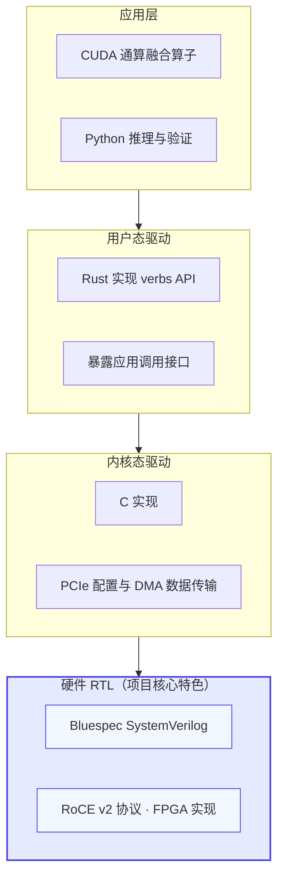
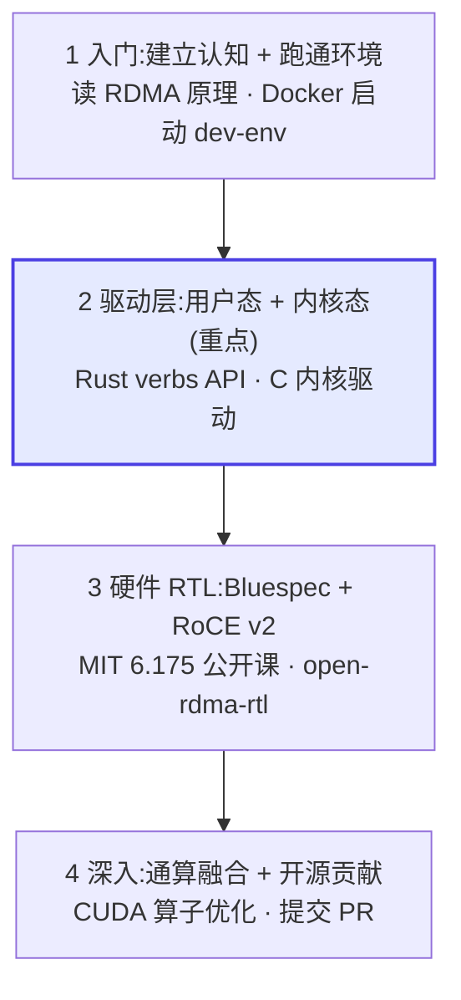

# Open-RDMA 项目介绍与学习指南

## 项目简介

Open-RDMA 是由琶洲实验室（黄埔）与达坦科技（Datenlord）联合发起的全栈开源 RDMA 项目，目标是做一套从硬件 RTL 到软件驱动完全透明、面向 AI 场景的高性能 RDMA 实现，对标 Mellanox 等商用闭源网卡。项目的核心卖点是"打破黑盒"——连硬件设计都开源。

随着 AI 大模型的发展，RDMA 提供的高性能网络已成为 AI 基础设施的关键。但诞生于上世纪的 RDMA 技术难以完全适配今天的 AI 计算场景：商用方案受历史兼容性拖累难以快速迭代，闭源网卡又与开源的 AI 软件生态形成矛盾。Open-RDMA 选择从学术研究和人才培养切入，依托社区力量降低 RDMA 技术门槛。

无论你来自硬件（FPGA、ASIC）、软件（驱动开发、训练推理框架、通信协议）还是算法（GPU Kernel）领域，都能在这个项目里找到契合自己的方向。

## 全栈架构

项目从底层硬件 RTL 到上层应用共分四层，每一层都完全开源。其中硬件 RTL 是项目最具特色的一层——商用网卡从不公开这部分。



| 层级 | 技术栈 | 子仓库 | 职责 |
| --- | --- | --- | --- |
| 应用层 | CUDA、Python | 开发中 | 通算融合算子、推理与验证 |
| 用户态驱动 | Rust | `open-rdma-driver` | 实现 verbs API，提供应用调用接口 |
| 内核态驱动 | C | `open-rdma-driver` | PCIe 配置与 DMA 数据传输 |
| 硬件 RTL | Bluespec SystemVerilog | `open-rdma-rtl` | RoCE v2 协议的 FPGA 硬件实现 |

## 项目矩阵

本地 clone 的 `open-rdma/open-rdma` 是一个门面仓库，只有 README 和 LICENSE，实际代码分散在以下子仓库中，需要分别 clone。

| 子仓库 | 内容 | 技术栈 |
| --- | --- | --- |
| `open-rdma-rtl` | 硬件 RTL 设计（核心特色） | Bluespec SystemVerilog |
| `open-rdma-driver` | 用户态 + 内核态驱动 | Rust + C |
| `open-rdma-dev-env` | 开箱即用开发环境 | Docker |
| `bluespec-lsp` | BSV 语言服务器 | — |
| `UCAgent` (fork) | AI Agent 驱动的 RTL 验证 | Python / Cocotb |
| `cocotbext-pcie` (fork) | PCIe 仿真模型 | Python / Cocotb |

## 学习路径

结合你熟悉 RCCL 和集合通信算子（AllReduce、AllGather、ReduceScatter）的背景，学习重点应该放在驱动层——这是 RDMA 与集合通信库对接的接口层。RCCL 这类集合通信库底层正是通过 RDMA verbs API（如 `ibv_post_send`、`ibv_poll_cq`）调用网卡。Open-RDMA 的 Rust 用户态驱动就是这层接口的开源实现。你熟悉 AllReduce 的上层语义，再往下看 verbs 如何映射到硬件操作，就能打通"集合通信算子 → RDMA 请求 → 硬件 DMA"的完整链路——这正是商用网卡不开放的部分。



### 阶段一：入门与跑通环境

先读 RDMA 原理建立整体概念，再用 Docker 镜像启动开箱即用环境。这一步不写代码，目标是让环境跑起来，并对 RDMA 的工作方式有大致认知。

参考资源：RDMA 杂谈专栏（知乎）、`open-rdma-dev-env` 仓库。

### 阶段二：驱动层（重点）

从 Rust 用户态 verbs API 入手，理解 RDMA 如何暴露给上层集合通信库；再读 C 内核驱动，掌握 PCIe 配置与 DMA 数据通路。这一层直接对接你熟悉的 RCCL，是性价比最高的学习入口。

参考资源：`open-rdma-driver` 仓库及其 `docs/zh-CN/records/weekly-report/` 周报目录。

### 阶段三：硬件 RTL

学 MIT 6.175 掌握 Bluespec SystemVerilog 硬件描述语言，再读 `open-rdma-rtl` 的 RoCE v2 实现。这一层是项目最独特的地方，也是理解 RDMA 性能上限的关键。

参考资源：MIT 6.175 公开课及实验、B 站 MIT 课程中文指引、`open-rdma-rtl` 仓库。

### 阶段四：深入与贡献

结合 AllReduce 等集合通信算子做通算融合优化，提交 PR 参与社区。项目正在招募 AI-Infra 方向实习生，涵盖 GPU 算子优化、推理框架优化、高性能网络、RTL 验证等方向。

参考资源：CUDA 算子、GitHub Discussions。

## 第一步操作

按顺序执行以下命令，先跑通环境，再读驱动代码：

```bash
# 1. clone 开发环境(门面仓库没有代码,需要单独 clone 子仓库)
git clone https://github.com/open-rdma/open-rdma-dev-env.git
cd open-rdma-dev-env
docker-compose up -d        # 启动开箱即用环境

# 2. clone 驱动仓库(学习重点)
git clone https://github.com/open-rdma/open-rdma-driver.git

# 3. clone 硬件 RTL(后续深入硬件时用)
git clone https://github.com/open-rdma/open-rdma-rtl.git
```

## 学习资源汇总

**RDMA 入门**

- [RDMA 杂谈专栏](https://zhuanlan.zhihu.com/p/164908617) — 知乎中文专栏，先建立整体认知

**Bluespec SystemVerilog**

- [MIT 6.175 公开课及课程实验](https://csg.csail.mit.edu/6.175)
- [B 站 MIT 课程中文学习指引](https://www.bilibili.com/video/BV1u8411i7Qw)
- [MIT 6.004 公开课](https://www.youtube.com/watch?v=n-YWa8hTdH8)

**PCIe**

- [A Practical Tutorial on PCIe for Total Beginners](https://ctf.re/windows/kernel/pcie/tutorial/2023/02/14/pcie-part-1/) — 虽以 Windows 为例，但绝大多数内容与平台无关
- [知乎：可以学习 1W 小时的 PCIe](https://www.zhihu.com/tardis/zm/art/447134701)

**项目动态**

`open-rdma-driver` 仓库的 `docs/zh-CN/records/weekly-report/` 目录有持续更新的开源周报，是跟踪项目进展的入口。
